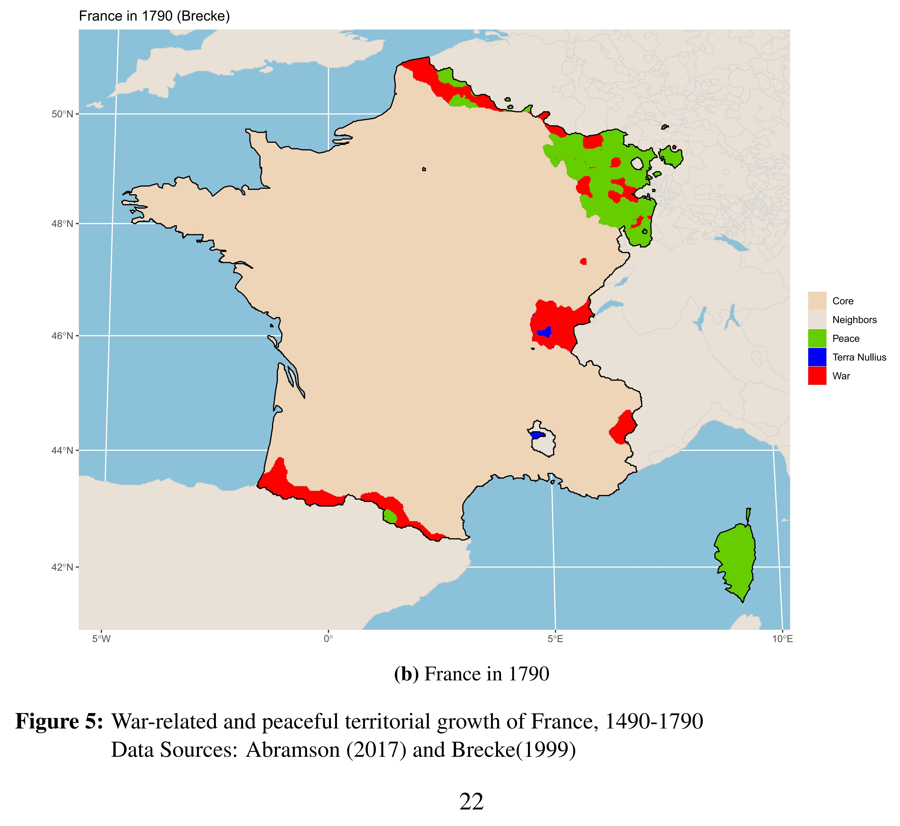

```{r}
library(patchwork)
library(tidyverse)
```

# First try: Thinkquest

This website allows to download historical maps. They don't cover each year but would suffice. They start with 1492 and finish in 1793 or 1815. However, the level of detail is really reduced and it doesn't include subnational units. I decide to try with another source of data. 

https://web.archive.org/web/20080328104539/http://library.thinkquest.org:80/C006628/download.html 
```{r eval=FALSE, include=FALSE}
map_1492 <- sf::st_read("G:/Mi unidad/Hiwi Statistics Assistant/Selection Schenoni/Map_schenoni/mapa/1492/cntry1492.shp")
map_1530 <- sf::st_read("G:/Mi unidad/Hiwi Statistics Assistant/Selection Schenoni/Map_schenoni/mapa/1530/cntry1530.shp")
map_1650 <- sf::st_read("G:/Mi unidad/Hiwi Statistics Assistant/Selection Schenoni/Map_schenoni/mapa/1650/cntry1650.shp")
map_1783 <- sf::st_read("G:/Mi unidad/Hiwi Statistics Assistant/Selection Schenoni/Map_schenoni/mapa/1783/cntry1783.shp")
map_1815 <- sf::st_read("G:/Mi unidad/Hiwi Statistics Assistant/Selection Schenoni/Map_schenoni/mapa/1815/cntry1815.shp")

m1492 <- map_1492%>%
  filter(FIPS_CODE=="FR")%>%
  ggplot()+
  geom_sf()+
  labs(title="1492")

m1530 <- map_1530%>%
  filter(FIPS_CODE=="FR")%>%
  ggplot()+
  geom_sf()+
  labs(title="1530")

m1650 <- map_1650%>%
  filter(FIPS_CODE=="FR")%>%
  ggplot()+
  geom_sf()+
  labs(title="1650")

m1783 <- map_1783%>%
  filter(FIPS_CODE=="FR")%>%
  ggplot()+
  geom_sf()+
  labs(title="1783")


m1815 <- map_1815%>%
  filter(FIPS_CODE=="FR")%>%
  ggplot()+
  geom_sf()+
  labs(title="1815")
#This works but it's not accurated at all. Furthermore, it doesn't include subnational units.
```

# Second try: Eurostat data

It is well defined, but not historical.

```{r echo=TRUE, message=FALSE}
database <- sf::st_read(paste0(getwd(), "/COMM_RG_01M_2016_3857.shp"))
```

First I extract the current territories of France (excluding e.g. Nice), Andorra, and the Palatinate Freicities (part of France in 1790).

```{r territories}
#Extract current territories of continental France and Andorra  
andorra <- database%>%
  filter(COMM_ID=="AD")%>%
  mutate(NSI_CODE="AD")
  
apt_capentras <- c("84002","84003","84006","84009","84010","84013","84014","84020","84023","84024","84025","84026","84032","84033","84035","84038","84042","84047","84048","84050","84051","84052","84057","84058","84060","84062","84065","84066","84068","84071","84073","84074","84076","84084","84085","84086","84089","84090","84093","84095","84099","84102","84103","84105","84112","84113","84114","84118","84121","84128","84131","84133","84140","84144","84145","84147","84151","84001","84004","84005","84008","84011","84012","84015","84017","84018","84019","84021","84022","84027","84028","84029","84030","84031","84037","84040","84041","84044","84045","84046","84049","84053","84056","84059","84061","84063","84064","84067","84069","84070","84072","84075","84077","84078","84079","84080","84082","84083","84087","84088","84091","84094","84096","84097","84098","84100","84101","84104","84106","84107","84108","84109","84110","84111","84115","84116","84117","84120","84122","84123","84125","84126","84127","84130","84134","84135","84136","84137","84138","84143","84146","84148","84149","84150")

nice <- c("06001","06002","06003","06004","06007","06010","06017","06018","06022","06024","06025","06026","06027","06028","06029","06030","06033","06037","06038","06041","06044","06045","06047","06049","06050","06058","06061","06063","06064","06065","06068","06069","06070","06079","06081","06084","06085","06087","06089","06090","06095","06107","06105","06108","06112","06116","06118","06122","06123","06128","06130","06131","06134","06137","06138","06140","06148","06152","06154","06155","06157","06161")

france <- database%>%
  filter(CNTR_ID=="FR")%>%
  filter(NUTS_CODE!="FRY1",
         NUTS_CODE!="FRY2",
         NUTS_CODE!="FRY3",
         NUTS_CODE!="FRY4",
         NUTS_CODE!="FRY5",
         NUTS_CODE!="FRY10",
         NUTS_CODE!="FRY20",
         NUTS_CODE!="FRY30",
         NUTS_CODE!="FRY40",
         NUTS_CODE!="FRY50",
         NUTS_CODE!="FRK27",
         NUTS_CODE!="FRK28",
         NUTS_CODE!="FRL03", 
         NUTS_CODE!="FRC24")%>%
  filter(NSI_CODE!=apt_capentras)%>%
  filter(NSI_CODE!=nice)

palatinate_freicities <- c("DEB31","DEB32","DEB33","DEB34","DEB35","DEB36","DEB37","DEB38","DEB39","DEB3A")

germany <- database%>%filter(CNTR_CODE=="DE")%>%filter(NUTS_CODE%in%palatinate_freicities)
germany_nsi <- germany$NSI_CODE
```

Secondly I define the historical regions and the municipalities included in them. 

```{r extract_NSI_code}
#Define historical regions  


avignon <- c("84007", "84016", "84034", "84036", "84039", "84043", "84054", "84055", "84081", "84092", "84119", "84124", "84129", "84132", "84139", "84141", "84142")

artois <- c("62002","62004","62005","62006","62007","62009","62011","62012","62013","62027","62030","62036","62037","62039","62041","62042","62045","62047","62058","62060","62061","62063",
            "62064","62068","62070","62071","62072","62073","62074","62079","62080","62081","62082",
            "62084","62085","62086","62091","62092","62093","62096","62097","62099","62881","62101",
            "62103","62106","62109","62111","62112","62113","62114","62115","62117","62118","62121",
            "62122","62128","62129","62130","62131","62135","62137","62143","62144","62145","62147",
            "62146","62151","62152","62154","62158","62163","62164","62166","62171","62172","62173",
            "62180","62181","62182","62184","62185","62187","62189","62192","62199","62198","62208",
            "62211","62216","62221","62223","62234","62238","62240","62242","62243","62248","62253",
            "62258","62259","62260","62263","62266","62272","62279","62280","62283","62284","62285",
            "62290","62298","62299","62301","62303","62306","62316","62317","62319","62320","62322",
            "62323","62324","62326","62331","62332","62333","62337","62339","62340","62341","62342",
            "62343","62344","62345","62346","62347","62348","62352","62353","62355","62358","62361",
            "62362","62363","62367","62368","62369","62370","62372","62374","62375","62378","62379",
            "62381","62383","62384","62385","62387","62389","62392","62396","62399","62404","62405",
            "62406","62409","62410","62411","62414","62415","62416","62418","62421","62422","62424",
            "62425","62426","62428","62430","62433","62434","62435","62436","62438","62440","62442",
            "62450","62451","62459","62462","62465","62467","62468","62469","62475","62476","62477",
            "62484","62490","62493","62494","62507","62511","62514","62513","62515","62518","62519",
            "62536","62537","62539","62542","62544","62553","62557","62558","62559","62561","62568",
            "62572","62574","62576","62577","62578","62579","62580","62581","62582","62583","62586",
            "62589","62590","62591","62593","62594","62597","62600","62601","62607","62608","62609",
            "62611","62612","62616","62619","62627","62629","62630","62631","62633","62638","62639",
            "62640","62641","62646","62649","62650","62651","62652","62655","62660","62663","62664",
            "62665","62668","62669","62671","62672","62673","62680","62683","62686","62689","62694",
            "62695","62697","62703","62708","62709","62712","62714","62715","62717","62718","62722",
            "62728","62731","62732","62733","62734","62739","62740","62741","62744","62753","62754",
            "62761","62763","62764","62767","62776","62777","62778","62779","62780","62781","62782",
            "62784","62785","62791","62795","62796","62797","62798","62800","62802","62804","62805",
            "62808","62809","62810","62813","62814","62816","62817","62818","62820","62822","62825",
            "62829","62830","62831","62833","62835","62838","62839","62840","62855","62856","62857",
            "62858","62859","62860","62864","62865","62869","62873","62874","62876","62877","62878",
            "62879","62883","62891","62892","62909","62023","62028","62029","62034","62035","62048",
            "62049","62051","62077","62083","62119","62120","62126","62132","62141","62162","62178",
            "62188","62190","62194","62195","62197","62200","62217","62218","62224","62232","62252",
            "62262","62269","62270","62276","62278","62286","62310","62313","62314","62328","62330",
            "62338","62349","62350","62356","62366","62373","62376","62377","62391","62400","62401",
            "62407","62441","62443","62445","62454","62456","62457","62473","62479","62480","62486",
            "62489","62491","62500","62502","62508","62509","62512","62516","62517","62520","62529",
            "62532","62540","62555","62564","62584","62617","62606","62620","62626","62632","62642",
            "62676","62693","62701","62706","62713","62720","62727","62735","62736","62747","62750",
            "62770","62836","62841","62846","62847","62848","62851","62863","62885","62900","62008",
            "62010","62014","62024","62040","62053","62055","62067","62088","62087","62095","62471",
            "62139","62140","62149","62153","62155","62169","62205","62225","62228","62229","62245",
            "62254","62265","62267","62271","62288","62292","62295","62297","62304","62308","62309",
            "62325","62327","62336","62403","62419","62423","62452","62458","62478","62485","62495",
            "62504","62525","62534","62543","62567","62569","62592","62595","62613","62618","62622",
            "62644","62656","62674","62675","62681","62684","62692","62696","62702","62704","62721",
            "62691","62760","62757","62765","62772","62788","62792","62794","62803","62811","62812",
            "62819","62827","62837","62875","62882","62897","62898","62901","62902","62904","62905",
            "62001","62003","62019","62032","62033","62065","62107","62133","62148","62170","62186",
            "62213","62215","62249","62250","62274","62277","62291","62311","62321","62351","62371",
            "62380","62386","62413","62427","62464","62497","62498","62907","62510","62523","62528",
            "62563","62570","62573","62587","62624","62628","62637","62666","62724","62737","62771",
            "62793","62801","62842","62854","62861","62895","62895","62050","62069","62090","62138",
            "62142","62282","62335","62357","62365","62388","62470","62541","62605","62625","62647",
            "62677","62719","62749","62828","62834","62850","62868","62872","62890")

briancon <- c("05001", "05003", "05006", "05007", "05023", "05026", "05027", "05031", "05038", "05052", "05058", "05063", "05065", "05077", "05079", "05082", "05085", "05093", "05107", "05109", "05110", "05116", "05119", "05122", "05133", "05134", "05136", "05151", "05157", "05161", "05174", "05101", "05177", "05180", "05181", "05183")

lille <- c("59005","59011","59013","59017","59022","59025","59034","59042","59044","59051","59052","59056","59071","59088","59090","59096","59098","59106","59123","59124","59128","59129","59133","59143","59145","59146","59150","59152","59163","59168","59173","59670","59193","59195","59196","59197","59201","59202","59208","59220","59247","59250","59252","59256","59257","59258","59266","59275","59278","59279","59281","59286","59299","59303","59304","59316","59317","59320","59328","59332","59339","59343","59346","59350","59352","59356","59360","59364","59367","59368","59371","59378","59386","59388","59398","59408","59410","59411","59419","59421","59427","59426","59437","59452","59457","59458","59462","59466","59470","59477","59482","59487","59507","59508","59512","59522","59523","59524","59527","59550","59553","59560","59566","59585","59586","59592","59598","59599","59600","59602","59609","59611","59009","59630","59636","59638","59643","59646","59648","59650","59653","59656","59658","59660")

cambrai <- c("59001","59010","59023","59037","59039","59047","59048","59049","59055","59059","59060","59063","59069","59074","59075","59081","59085","59097","59102","59108","59118","59121","59122","59125","59127","59132","59136","59137","59138","59139","59140","59141","59149","59161","59167","59171","59176","59191","59204","59206","59209","59213","59219","59216","59236","59243","59244","59255","59267","59269","59274","59287","59289","59294","59300","59311","59312","59321","59322","59341","59349","59372","59377","59382","59389","59394","59395","59405","59412","59413","59415","59422","59428","59430","59432","59438","59450","59455","59465","59476","59485","59488","59492","59496","59498","59500","59502","59506","59517","59520","59521","59528","59531","59533","59537","59541","59545","59547","59552","59558","59567","59571","59575","59593","59595","59597","59604","59608","59612","59614","59622","59623","59624","59625","59631","59635")

castellane <- c("04005", "04006","04007","04008","04022","04025","04030","04032","04039","04042","04043","04055","04059","04061","04069","04076","04090","04092","04099","04115","04133","04136","04144","04148","04170","04171","04173","04174","04180","04183","04187","04194","04202","04204","04210","04214","04218","04219","04224","04236","04240")

corsica <- france%>%filter(NUTS_CODE=="FRM01"|NUTS_CODE=="FRM02")
corsica <- corsica$NSI_CODE

dunkerque <- c("59016","59018","59043","59046","59054","59067","59073","59082","59083","59084","59086","59087","59089","59091","59094","59107","59110","59111","59119","59120","59130","59131","59135","59155","59159","59162","59180","59182","59183","59184","59189","59200","59210","59212","59237","59260","59262","59268","59271","59272","59273","59282","59293","59295","59305","59307","59308","59309","59318","59319","59326","59337","59338","59340","59358","59359","59366","59397","59399","59400","59401","59402","59416","59423","59431","59433","59436","59443","59448","59453","59454","59463","59469","59478","59497","59499","59516","59532","59535","59536","59538","59539","59546","59568","59570","59576","59577","59578","59579","59580","59581","59582","59587","59588","59590","59605","59615","59628","59634","59641","59647","59655","59657","59662","59663","59664","59665","59666","59667","59668","59669")

charleville_mezieres <- c("08190","08028","08106","08122","08175","08183","08207","08226","08247","08353","08486","08487","08185","08166","08214","08222","08304")

dombes <- c( "01093","01001","01028","01045","01052","01074","01083","01085","01090","01092","01113","01129","01146","01207","01299","01235","01248","01261","01272","01319","01328","01333","01335","01356","01359","01371","01381","01382","01383","01389","01393","01412","01428","01434","01443","01449")

orange <- c("26054", "26103", "26209", "26345", "26357", "26374", "84039", "84019", "84049", "84056", "84078", "84087", "84130", "84149")

rossello <- france%>%filter(NUTS_CODE=="FRJ15")
rossello <- rossello$NSI_CODE

pyror <- france%>%filter(NUTS_CODE=="FRI15")
pyror <- pyror$NSI_CODE

valcluse <- france%>%filter(NUTS_CODE=="FRL06")%>%filter(!NSI_CODE%in%avignon)
valcluse <- valcluse$NSI_CODE

ain <- france%>%filter(NUTS_CODE=="FRK21")%>%filter(!NSI_CODE%in%dombes)
ain <- ain$NSI_CODE

thann_guebwiller <- c("68011","68012","68029","68030","68037","68040","68045","68046","68058","68059","68060","68063","68073","68082","68089","68102","68106","68111","68112","68115","68116","68122","68123","68151","68156","68159","68167","68171","68177","68178","68179","68180","68188","68199","68201","68203","68205","68211","68213","68217","68219","68228","68229","68234","68235","68239","68241","68242","68247","68250","68251","68255","68260","68261","68262","68266","68274","68275","68276","68279","68287","68292","68302","68304","68307","68308","68313","68315","68318","68322","68328","68334","68342","68344","68348","68359","68361","68364","68370","68372","68381")

mulhausen <- "68224"


haut_rihn <- france%>%filter(NUTS_CODE=="FRF12")%>%filter(!NSI_CODE%in%mulhausen)%>%filter(!NSI_CODE%in%thann_guebwiller)
haut_rihn <- haut_rihn$NSI_CODE

besancon <- "25056"

haguenau_arrond <- c("67012","67023","67025","67033","67035","67037","67038","67039","67046","67048","67067","67069","67074","67075","67079","67082","67083","67087","67093","67100","67104","67106","67110","67113","67123","67132","67140","67141","67142","67147","67151","67156","67160","67169","67174","67176","67177","67180","67184","67186","67194","67203","67205","67206","67213","67215","67221","67230","67231","67232","67235","67237","67238","67249","67250","67252","67254","67257","67259","67260","67261","67263","67264","67271","67288","67290","67291","67292","67298","67301","67303","67304","67305","67308","67315","67319","67324","67327","67328","67330","67331","67334","67339","67340","67341","67344","67345","67346","67349","67351","67353","67356","67358","67359","67361","67372","67379","67388","67394","67400","67404","67405","67407","67409","67415","67416","67417","67418","67432","67440","67443","67449","67450","67451","67455","67458","67463","67465","67466","67472","67474","67476","67479","67484","67487","67494","67497","67498","67502","67510","67511","67523","67529","67536","67537","67540","67541","67544","67546","67550","67558")

bas_rhin <- france%>%filter(NUTS_CODE=="FRF11")%>%filter(!NSI_CODE%in%haguenau_arrond)
bas_rhin <- bas_rhin$NSI_CODE

vosgues <- france%>%filter(NUTS_CODE=="FRF34")
vosgues <- vosgues$NSI_CODE


lorraine <- france%>%filter(NUTS_CODE%in%c("FRF31", "FRF32", "FRF33", "FRF34"))
lorraine <- lorraine$NSI_CODE


avesnes_sur_helpe <- c("59003","59006","59012","59021","59031","59033","59035","59036","59041","59045","59050","59053","59057","59058","59061","59062","59065","59066","59068","59070","59072","59076","59077","59078","59093","59099","59101","59103","59104","59116","59134","59142","59147","59148","59151","59157","59164","59169","59174","59175","59177","59181","59186","59187","59188","59190","59194","59198","59217","59218","59223","59225","59226","59229","59230","59231","59232","59233","59240","59241","59242","59246","59249","59251","59259","59261","59264","59265","59270","59277","59283","59290","59291","59296","59306","59310","59315","59323","59324","59325","59331","59333","59344","59342","59347","59351","59353","59357","59363","59365","59370","59374","59381","59384","59385","59392","59396","59406","59420","59424","59425","59439","59441","59442","59445","59451","59461","59464","59467","59468","59472","59473","59474","59481","59483","59490","59493","59494","59495","59503","59514","59518","59525","59529","59534","59542","59543","59548","59549","59555","59556","59562","59563","59565","59572","59573","59583","59584","59601","59607","59617","59618","59619","59626","59627","59633","59639","59640","59649","59659","59661")

nancy <- c("54001", "54005", "54006", "54012", "54021", "54024", "54025", "54027", "54031", "54032", "54037", "54042", "54043", "54059", "54060", "54062", "54070", "54072", "54079", "54089", "54090", "54091", "54092", "54094", "54095", "54100", "54104", "54108", "54109", "54110", "54111", "54113", "54114", "54115", "54117", "54123", "54126", "54131", "54132", "54141", "54142", "54144", "54150", "54156", "54157", "54159", "54164", "54165", "54168", "54179", "54180", "54184", "54185", "54186", "54188", "54192", "54193", "54196", "54197", "54203", "54204", "54207", "54214", "54215", "54219", "54221", "54224", "54235", "54238", "54241", "54247", "54250", "54252", "54257", "54264", "54265", "54266", "54268", "54274", "54276", "54278", "54279", "54289", "54291", "54294", "54296", "54299", "54300", "54301", "54304", "54305", "54307", "54309", "54310", "54311", "54312", "54313", "54315", "54320", "54328", "54330", "54332", "54333", "54336", "54338", "54339", "54344", "54345", "54351", "54352", "54354", "54357", "54358", "54364", "54366", "54369", "54372", "54374", "54375", "54376", "54387", "54390", "54395", "54397", "54399", "54400", "54403", "54407", "54409", "54411", "54415", "54417", "54424", "54429", "54430", "54431", "54432", "54433", "54434", "54435", "54437", "54439", "54442", "54444", "54456", "54459", "54462", "54464", "54465", "54468", "54473", "54474", "54482", "54483", "54486", "54490", "54495", "54497", "54498", "54508", "54510", "54513", "54515", "54516", "54517", "54522", "54526", "54527", "54546", "54547", "54549", "54552", "54553", "54554", "54558", "54563", "54569", "54571", "54577", "54578", "54579", "54586", "54587", "54589", "54591", "54592", "54596", "54597")

nancy_1 <- c("54042", "54265", "54547", "54395")

douai <- c("59004", "59007", "59008", "59015", "59024", "59026", "59028", "59029", "59080", "59105", "59113", "59115", "59117", "59126", "59156", "59158", "59165", "59170", "59178", "59185", "59199", "59203", "59211", "59214", "59222", "59224", "59227", "59228", "59234", "59239", "59254", "59263", "59276", "59280", "59314", "59327", "59329", "59330", "59334", "59336", "59345", "59354", "59375", "59379", "59390", "59409", "59414", "59435", "59449", "59456", "59486", "59489", "59501", "59509", "59513", "59551", "59569", "59574", "59596", "59620", "59629", "59637", "59642", "59654")

valenciennes <- c("59002", "59014", "59019", "59027", "59032", "59038", "59064", "59079", "59092", "59100", "59109", "59112", "59114", "59144", "59153", "59160", "59166", "59172", "59179", "59192", "59205", "59207", "59215", "59221", "59238", "59253", "59284", "59285", "59288", "59292", "59297", "59301", "59302", "59313", "59335", "59348", "59361", "59369", "59383", "59387", "59391", "59393", "59403", "59407", "59418", "59429", "59434", "59440", "59444", "59446", "59447", "59459", "59471", "59475", "59479", "59480", "59484", "59491", "59504", "59505", "59511", "59515", "59519", "59526", "59530", "59544", "59554", "59557", "59559", "59564", "59589", "59591", "59594", "59603", "59606", "59610", "59613", "59616", "59632", "59645", "59651", "59652")

metz <- c("57017", "57019", "57020", "57021", "57024", "57028", "57030", "57031", "57032", "57037", "57039", "57043", "57049", "57055", "57057", "57075", "57111", "57116", "57121", "57125", "57127", "57128", "57129", "57134", "57137", "57139", "57140", "57142", "57145", "57146", "57147", "57148", "57153", "57155", "57156", "57162", "57193", "57200", "57204", "57211", "57212", "57218", "57219", "57220", "57231", "57249", "57251", "57254", "57256", "57283", "57303", "57307", "57350", "57351", "57352", "57385", "57392", "57396", "57403", "57412", "57415", "57416", "57422", "57425", "57431", "57433", "57438", "57443", "57445", "57447", "57449", "57452", "57454", "57463", "57467", "57472", "57480", "57481", "57482", "57487", "57510", "57511", "57512", "57515", "57527", "57532", "57533", "57534", "57543", "57545", "57546", "57547", "57548", "57552", "57553", "57554", "57563", "57572", "57575", "57578", "57591", "57593", "57601", "57605", "57607", "57612", "57616", "57617", "57620", "57622", "57624", "57626", "57627", "57634", "57642", "57643", "57645", "57648", "57649", "57652", "57653", "57654", "57655", "57656", "57663", "57671", "57676", "57677", "57693", "57694", "57701", "57707", "57708", "57715", "57716", "57718", "57736", "57737", "57751")

luneville <- c("54013","54014","54017","54020","54023","54026","54030","54035","54038","54039","54040","54044","54045","54050","54053","54054","54061","54064","54065","54071","54074","54075","54076","54077","54078","54083","54085","54097","54098","54101","54106","54107","54116","54121","54124","54125","54129","54130","54133","54139","54145","54147","54148","54152","54154","54155","54161","54163","54170","54173","54175","54176","54177","54183","54191","54195","54199","54201","54206","54209","54210","54211","54216","54217","54222","54228","54229","54230","54233","54243","54245","54246","54251","54255","54256","54258","54259","54260","54262","54269","54271","54281","54285","54287","54292","54293","54297","54303","54308","54324","54325","54329","54331","54335","54349","54350","54356","54359","54365","54368","54373","54377","54381","54383","54386","54388","54393","54396","54398","54401","54406","54418","54419","54421","54422","54423","54427","54443","54445","54446","54447","54449","54450","54452","54455","54457","54458","54461","54467","54471","54472","54475","54479","54480","54481","54484","54487","54488","54501","54502","54507","54509","54512","54519","54520","54539","54540","54541","54543","54550","54551","54555","54556","54559","54560","54561","54562","54565","54567","54585","54588","54595","54600","54601")

saint_dizier <- c("52004 ","52006","52007","52012","52019","52021","52029","52030","52034","52039","52044","52045","52047","52055","52057","52065","52066","52079","52088","52091","52099","52104","52109","52110","52118","52123","52129","52131","52149","52156","52169","52171","52172","52173","52175","52177","52178","52179","52181","52182","52184","52187","52194","52198","52199","52201","52203","52206","52212","52218","52219","52222","52230","52231","52235","52244","52250","52265","52266","52267","52284","52288","52294","52300","52302","52316","52321","52327","52331","52336","52337","52341","52346","52347","52356","52357","52359","52370","52376","52378","52386","52391","52398","52411","52413","52414","52429","52436","52440","52442","52443","52448","52456","52463","52475","52479","52484","52487","52490","52491","52495","52497","52500","52502","52510","52511","52512","52528","52534","52543","52550")
```

Once I have the regions and their NSI codes, however, I have to convert them to FID. Otherwise, some NSI codes overlap with municipalities of other countries (e.g. Netherlands and Spain), which would affect the final map. 

```{r nsi_to_fid}
nsi_to_fid <- function(string_name){
  
string_name <- database%>%
  filter(CNTR_ID%in%c("AD", "DE", "FR"))%>%
  filter(NSI_CODE%in%string_name)
 string_name$FID
}

avignon <- nsi_to_fid(avignon)
dombes <- nsi_to_fid(dombes)
castellane <- nsi_to_fid(castellane)
artois <- nsi_to_fid(artois)
dunkerque <- nsi_to_fid(dunkerque)
rossello <- nsi_to_fid(rossello)
pyror <- nsi_to_fid(pyror)
ain <- nsi_to_fid(ain)
besancon <- nsi_to_fid(besancon)
thann_guebwiller <- nsi_to_fid(thann_guebwiller)
avesnes_sur_helpe <- nsi_to_fid(avesnes_sur_helpe)
nancy_1 <- nsi_to_fid(nancy_1)
douai <- nsi_to_fid(douai)
valenciennes <- nsi_to_fid(valenciennes)
metz <- nsi_to_fid(metz)
corsica <- nsi_to_fid(corsica)
lille <- nsi_to_fid(lille)
cambrai <- nsi_to_fid(cambrai)
charleville_mezieres <- nsi_to_fid(charleville_mezieres)
haut_rihn <- nsi_to_fid(haut_rihn)
haguenau_arrond <- nsi_to_fid(haguenau_arrond)
germany_nsi <- nsi_to_fid(germany_nsi)
vosgues <- nsi_to_fid(vosgues)
lorraine <- nsi_to_fid(lorraine)
valcluse <- nsi_to_fid(valcluse)
mulhausen <- nsi_to_fid(mulhausen)
bas_rhin <- nsi_to_fid(bas_rhin)
luneville <- nsi_to_fid(luneville)
saint_dizier <- nsi_to_fid(saint_dizier)
```

Finally, I assign each historical territory to one category (peace, war, terra nullius or neighbor). This helps me building a dataset of france with the variable "dades" that contains the information on the information that will be coloured in the map. 

```{r france_map_preparation_2}
terranullius_nsicode <- c(avignon, 
                          dombes)

war_nsicode <- c(castellane,
                 artois,
                 dunkerque,
                 rossello,
                 pyror,
                 ain,
                 besancon,
                 thann_guebwiller,
                 avesnes_sur_helpe, nancy_1,
                 douai,
                 valenciennes, 
                 metz,
                 luneville,
                 saint_dizier)

peace_nsicode <- c(
  corsica,
  lille, 
  cambrai, 
  charleville_mezieres, 
  haut_rihn,
  haguenau_arrond,
  germany_nsi,
  vosgues,
  lorraine)

neigbor_nsicode <- c(valcluse,mulhausen, bas_rhin)

france_0 <- france%>%
  rbind(andorra)%>%
  rbind.data.frame(germany)%>%
  mutate(
    dades=case_when(
      FID%in%war_nsicode ~ "War",
      CNTR_ID=="AD"|FID%in%peace_nsicode~"Peace",
      FID%in%terranullius_nsicode~"Terra Nullius",
      FID%in%neigbor_nsicode~"Neighbour",
      TRUE                      ~  "Core"))%>%
  filter(dades!="Neighbour")
```

The data I have so long looks like that. While it is informative, it still needs to include neighbour countries to resemle the original map. 

```{r france_map, echo=TRUE}
france_0%>%
  ggplot(aes(fill=dades, color=dades))+
  scale_fill_manual(values= c(
    "#eed5b7", 
#    "#E9E1D6", 
    "#66CD00", 
    "#0000FE", 
    "#FE0000"))+
  scale_color_manual(values=c(
    "#eed5b7", 
#    "#E9E1D6", 
    "#66CD00", 
    "#0000FE", 
    "#FE0000"))+
  geom_sf()+
  labs(title="France in 1790 (Brecke) - Replication Pau Grau", colour = "", fill="")+
  theme_bw()
```

Finally, I overwrite the orignal dataset with the "france_0" dataset (which contains information on how was the territory acquired) and I plot it. While it is not identical to the original map, I think is my best given the current data available. With more data I could be more precise, but at this point I think that putting more effort on collecting it would have a very low impact on the final result. 

```{r complete_map}
france_fid <- france_0$FID

database_1 <- database%>%
  filter(!FID%in%france_fid)%>%
  mutate(dades="Neighbour")%>%
  rbind.data.frame(france_0)


fullmap <- database_1%>%
  ggplot(aes(fill=dades, color=dades))+
  scale_fill_manual(values= c(
    "#eed5b7", 
    "#E9E1D6", 
    "#66CD00", 
    "#0000FE", 
    "#FE0000"))+
  scale_color_manual(values=c(
    "#eed5b7", 
    "#E9E1D6", 
    "#66CD00", 
    "#0000FE", 
    "#FE0000"))+
  geom_sf()+
  coord_sf(xlim=c(-600000.00, 1250000.00), ylim=c(5000000.00, 6800000.00))+
  labs(title="France in 1790 (Brecke) - Replication Pau Grau", colour = "", fill="")+
  theme_bw()

fullmap

```

The original map was:



